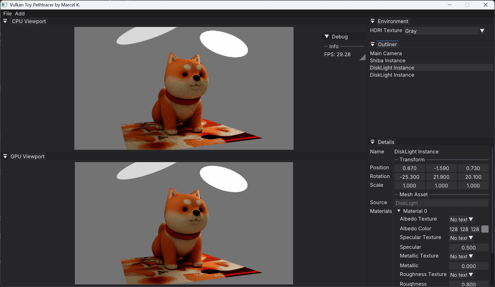

# VulkanToyPathtracer

This is my personal toy path tracer, built by Marcel Kazemi to experiment with and learn about ray tracing concepts on both the CPU and GPU. It’s my playground for exploring different rendering techniques.

---

## Chaos Camp 2025 Contributions

For Chaos Camp 2025, I worked on:

-   Porting the Vulkan shader-based path tracer to **CPU**, using **iterative ray tracing** that mimics the Vulkan ray tracing pipeline structure, including `raygen`, `traceRayEXT`, `closesthit`, and `miss` stages, to enable side-by-side comparisons and experimentation.

-   Implementing a **Bounding Volume Hierarchy** for efficient CPU-side ray intersection acceleration.

-   Adding multithreading support for CPU rendering, using **bucket rendering** to parallelize the workload efficiently.

-   Implementing Texture Sampling on the CPU.

-   Adding support for loading scenes from `.crtscene` files, a JSON-based format used in the ray tracing course.

---




---

## Features

-   **CPU and GPU Ray Tracing:** Implements path tracing on both CPU and GPU. GPU rendering uses **Vulkan hardware-accelerated ray tracing** via the official Vulkan ray tracing extension.

-   **Path Tracing with MIS:** Uses **unidirectional path tracing** with **multiple importance sampling (MIS)**. Supports combined **Lambertian diffuse** and **GGX specular** materials.
  
-   **Scene Loading:** Supports loading scenes from Wavefront `.obj` files and Chaos `.crtscene` files, a JSON-based custom scene format used in the Chaos Ray Tracing course.

-   **Material System:** PBR material properties such as albedo, metallic, roughness, and emission.

-   **ImGui Interface:** Provides a user interface to edit scene parameters, including camera settings, instance transforms, and material properties in real-time.


---

## Build Instructions

### Prerequisites

-   **Vulkan SDK:** Ensure the Vulkan SDK is installed and the `VULKAN_SDK` environment variable is set.
-   **CMake:** Version 3.10 or higher.
-   **Compiler:** A C++23-compatible compiler. **MinGW is recommended** (on Windows) due to usage of the `#embed` directive in the source code.

### Clone the Repository

Clone the repository including its submodules:

```bash
git clone --recursive https://github.com/Ka1serM/VulkanToyPathtracer.git
cd VulkanToyPathtracer
```

### Building the Project

1.  Create a build directory:

    ```bash
    mkdir build
    cd build
    ```

2.  Configure the project with CMake (MinGW + Release mode):

    ```bash
    cmake .. -G "MinGW Makefiles" -DCMAKE_BUILD_TYPE=Release -DCMAKE_EXPORT_COMPILE_COMMANDS=ON
    ```

3.  Build the project:

    ```bash
    cmake --build . --config Release
    ```

4.  Run the executable:

    The output executable will be located in the `build/` directory.

---

### Shader Compilation

The shaders are compiled using `glslc` from the Vulkan SDK. A `recompile.bat` script is provided in the `src/Shaders` directory to automate this process.

1.  Navigate to the shader directory:

    ```bash
    cd src/Shaders
    ```

2.  Run the script:

    ```bash
    recompile.bat
    ```

    This script compiles GLSL shaders to SPIR-V bytecode using `glslc`.

---

## Dependencies

This project uses the following libraries (included as submodules):

-   GLFW  
-   GLM  
-   portable-file-dialogs  
-   nlohmann\_json  
-   Dear ImGui  
-   tinyobjloader  
-   stb\_image  

Make sure to use `--recursive` when cloning to fetch all submodules properly.

## Important:
To run this application, you will need a graphics card that is compatible with Vulkan hardware-accelerated ray tracing (e.g., NVIDIA RTX series, AMD Radeon RX 6000 series and newer, Intel Arc series). Without such a GPU, the app will crash on open!

When running the compiled executable, please ensure that the ImGui.ini file is placed in the same directory as the executable. This file stores ImGui interface settings and is necessary for the UI to load correctly.